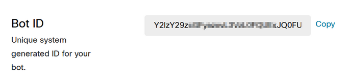
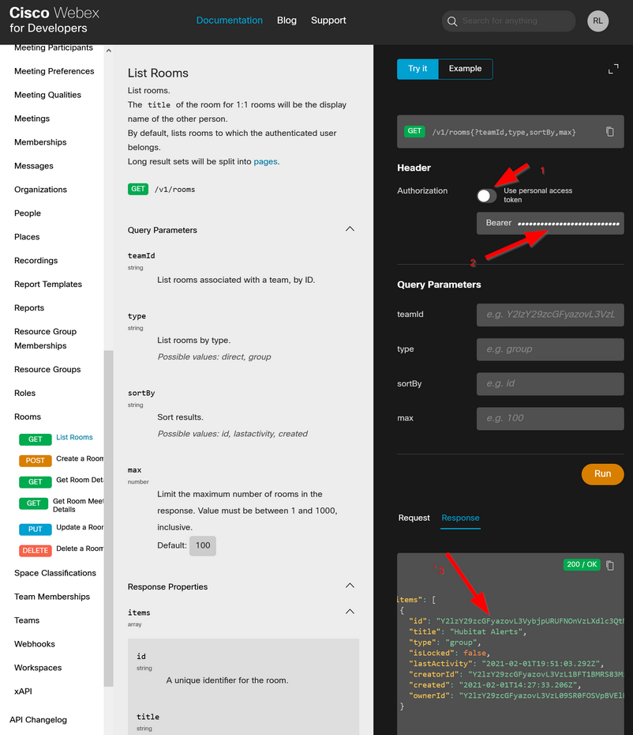

# Webex Notification Driver for Hubitat

Cisco Webex (formerly known as Webex Teams) is used for collaboration in many organizations. If
you're already a Webex user it just makes sense to bring your Hubitat notifications into the app.
Even if you're not a Webex user, this driver will work with a free account. 

Setup Instructions:
1. If not already using Webex, sign up for an account at https://teams.webex.com. Enter your email
address and if you don't have an account and your domain name is an enterprise customer already, you
will receive an email to activate your account. Activate it, set a password, set your display name. 
Click on Try Messaging to begin. 

2. Create a bot account at https://developer.webex.com. You'll have to sign in using your user account
(that you set up in step 1 if not already on the platform.) Click on the link for Bots or otherwise
create a new bot at https://developer.webex.com/my-apps/new/bot. It will require a globally unique
username. Upload a cool icon, or use one of the defaults.  Take note of the username 
(your_bot_name@webex.bot) as well as the Bot API access token.

3. Create a space that you will use for your notifications. You'll probably want to install the mobile 
and/or desktop client(s) on your devices. Once in the app with a space created, invite your bot from 
step 2 to the space using the three-dot menu in the space.

4. Navigate to https://developer.webex.com/docs/api/v1/rooms/list-rooms. If your browser is still 
logged in to the Webex platform you'll see your initials up top. If not, log in. On the right hand 
side of this API reference change the Authentication to use the bot's API token (1 & 2 in image)
then run the command. From the response section at the bottom, identify the room you added your 
bot to. Copy the ID (3 in image) and store it somewhere.

5. Add the two drivers (the parent and the device) to your HE hub (Drivers Code).

6. Create a new virtual device and set the type to Webex Parent and Save Device.

7. Enter the API auth token for your bot and press Save Preferences.

8. In the create device command, provide a label for your notification room on Webex and supply the
room ID that you captured in step 4.

From here you can use the notification device in Rule Machine. 
